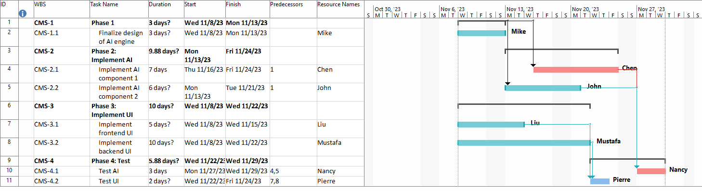
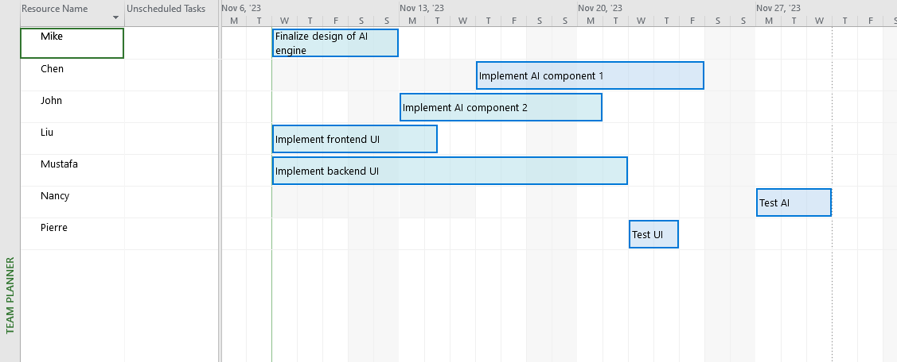
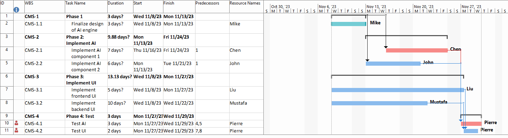
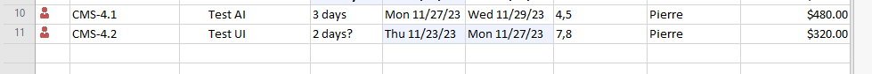
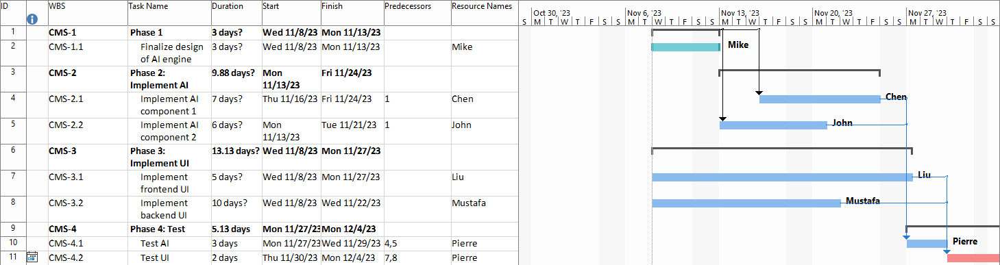
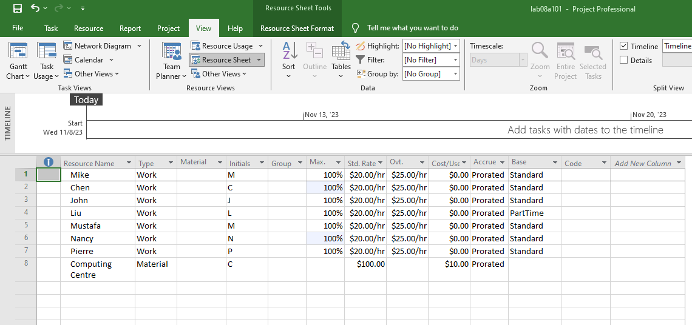
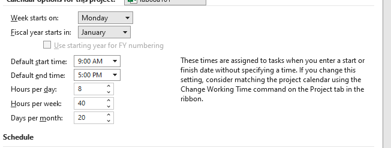

## Task 1:

[Task 1 MPP](assets/img/lab08a.mpp)

## Task 2:
### Pierre is now assigned to Task 'Test AI'

[Task 2 MPP](assets/img/lab08d.mpp)

Now Adding Pierre to Task "Test AI" as an additional assignment can potentially lead to resource allocation problems because Pierre is already assigned to "Test UI." This means that Pierre will have to split his time between these two tasks, which can impact the project schedule and may require some form of resource leveling to address the problem.

## Task 3: 

### F.1) 
The problem is resource overallocation for Pierre, as he is now assigned to two tasks simultaneously, "Test AI" and "Test UI."

### F.2) 
To solve this problem, resource leveling is needed. Resource leveling is the process of adjusting task assignments to avoid overallocation of resources.

###  F.3) Solution

[Task 3 MPP](assets/img/lab08f.mpp)

### F.4) Snapshot

### F.5) Comparing figure_e and figure_f:

For context, in the original project plan, Pierre was assigned to "Test UI" only, and there was no resource allocation problem.
In the altered figure (figure_e), a resource allocation problem arose, after assigning Pierre to "Test AI", as Pierre was simultaneously assigned to two tasks.
Now, after applying the resource leveling solution in figure_f, the resource allocation problem has been resolved. The schedule for "Test AI" and "Test UI" has been adjusted to ensure that Pierre's work hours do not exceed his availability, effectively leveling the resource allocation.

## Summary
In summary, the resource allocation problem was identified and resolved through resource leveling, ensuring that Pierre can effectively contribute to both "Test AI" and "Test UI" without overallocation issues.

### Additional

